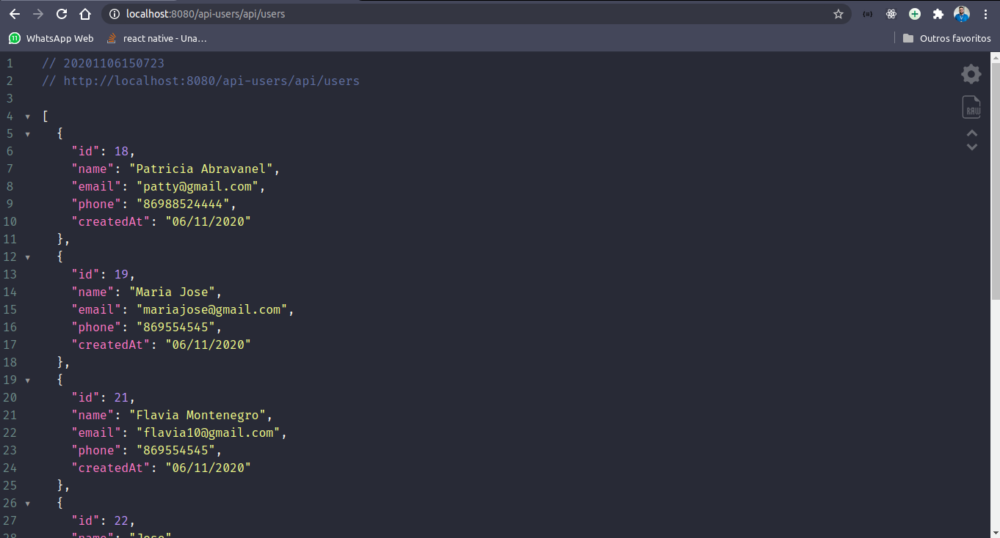
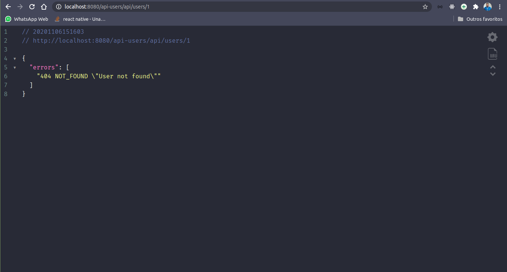
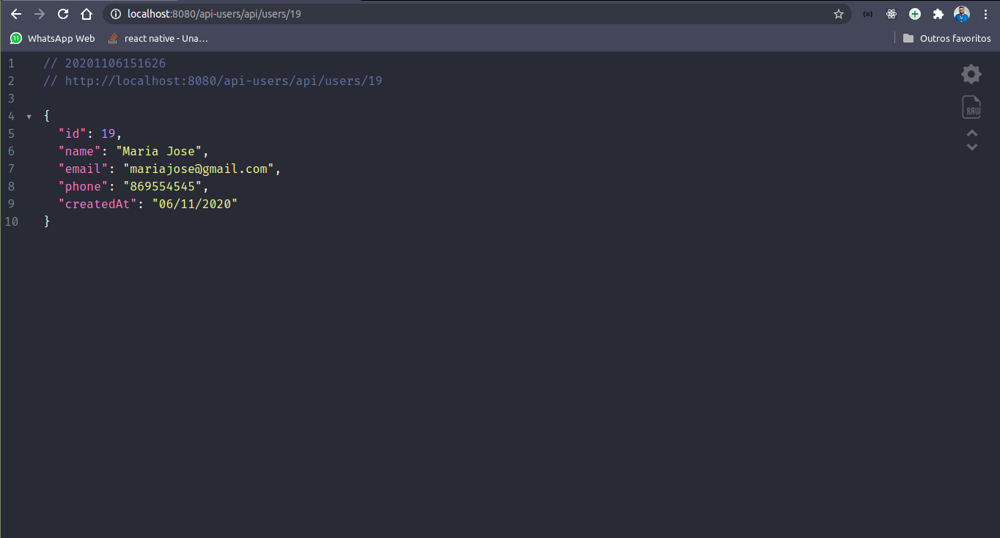

# App Users
> App desenvolvido para o teste de conhecimento Flutter/Java (Wk Technology).

# Solução
## API desenvolvida em Java Spring Boot com todos os endpoints para o CRUD de um usuário:
* GET: /api/users/ (User list)
* POST: /api/users/ (User create)
* UPDATE /api/users/ID/ (User update)
* DELETE /api/users/ID/ (User delete)
* GET /users/ID/ (User detail)

Persistência com MySQL.
Deploy local para testes com Glassfish.

# Imagens

## Time

José Vinícius  – lopesvinicius1707@gmail.com

